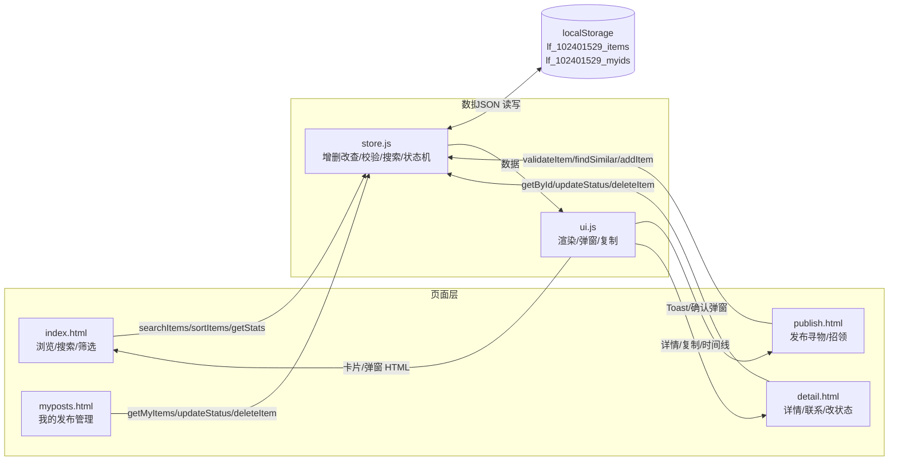
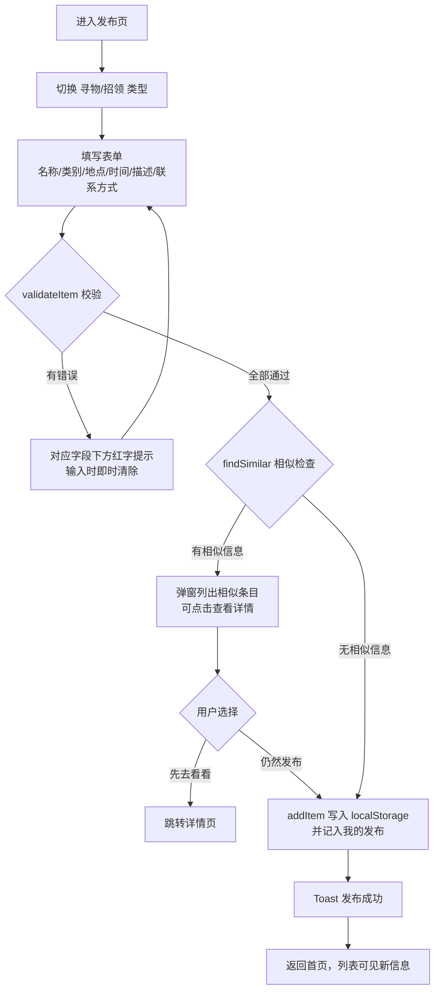
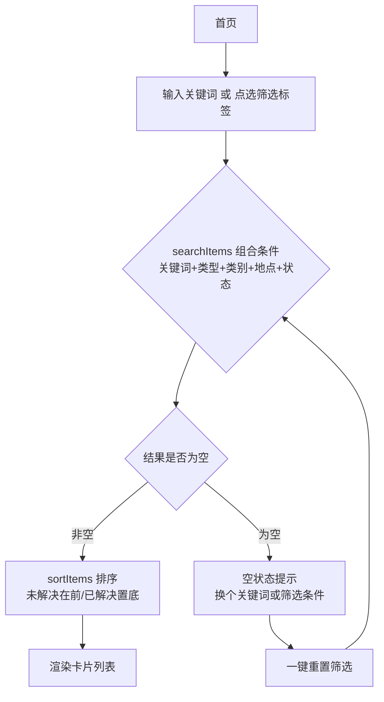

# 流程图与数据流图

> 博客中可直接粘贴以下 mermaid 代码（博客园若无法渲染，可用 mermaid.live 导出图片后插入）。
> 注意：图 3（状态更新）重点回答了作业点评中提出的三个问题——**谁来改、从哪个入口改、改后其他用户在哪里看到结果**。

## 图 1：系统整体数据流图（页面层 ↔ 数据层 ↔ 存储）



## 图 2：发布信息流程（含校验与相似提醒）



## 图 3：状态更新流程（状态闭环：谁来改、在哪改、别人看到什么）

```mermaid
flowchart TD
    subgraph 谁可以改
    M[本机发布的 id 记入<br>lf_102401529_myids]
    end
    subgraph 入口一：我的发布页
    P1[操作行: 标记已找到/已归还]
    end
    subgraph 入口二：详情页
    P2[底部按钮: 标记/删除]
    end
    subgraph 判断
    J{isMine id ?}
    end
    M --> J
    J -- 是 --> P1
    J -- 是 --> P2
    P1 --> K[确认弹窗] --> T[updateStatus resolved<br>记录 resolvedAt]
    P2 --> K
    T --> V1[首页: 卡片置灰沉底<br>标签变为已找到/已归还]
    T --> V2[详情页: 时间线显示<br>已于××标记为已找到]
    T --> V3[其他用户不再<br>重复询问]
    V1 --> W{可改回}
    W -- 点改回未解决 --> U[updateStatus active<br>清空 resolvedAt]
    U --> V1
```

## 图 4：搜索筛选流程


